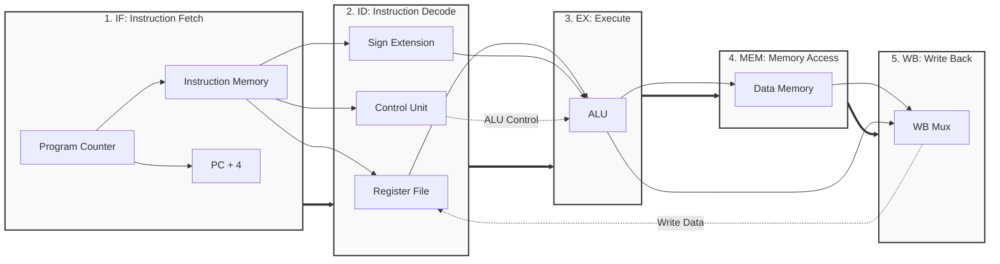

# Processor Architecture & Workflow Documentation

This document provides a deeper visual understanding of the 5-stage pipelined RISC processor. These diagrams are excellent reference materials to have on hand during technical interviews.

## 1. Top-Level Pin Diagram

Since this is an educational, self-contained implementation, the memory modules (Instruction Memory and Data Memory) are instantiated **inside** the top-level module. Therefore, the external interface is incredibly simple and clean:

```text
               +-----------------------------+
               |                             |
      clk  --->|                             |
               |      top_processor          |
      rst  --->|                             |
               |                             |
               +-----------------------------+
```

*Note for Interviews: If this were to be implemented on a physical FPGA where memory is external (e.g., DDR/SRAM), the pinout would expand to include Memory Address, Write Data, Read Data, and Write Enable signals.*

## 2. Pipeline Data Path Workflow

This workflow illustrates how data moves sequentially from one stage to the next. The pipeline registers (`IF_ID`, `ID_EX`, `EX_MEM`, `MEM_WB`) sit on the boundaries of these subgraphs to latch the data at the clock edge.



## 3. Instruction Execution Timeline (Pipeline Workflow)

To understand how pipelining increases processor throughput, here is a timeline of how instructions flow through the processor over multiple clock cycles.

| Cycle | 1 | 2 | 3 | 4 | 5 | 6 | 7 | 8 | 9 |
| :--- | :---: | :---: | :---: | :---: | :---: | :---: | :---: | :---: | :---: |
| **Instruction 1** | IF | ID | EX | MEM | WB | | | | |
| **Instruction 2** | | IF | ID | EX | MEM | WB | | | |
| **Instruction 3** | | | IF | ID | EX | MEM | WB | | |
| **Instruction 4** | | | | IF | ID | EX | MEM | WB | |
| **Instruction 5** | | | | | IF | ID | EX | MEM | WB |

*Key takeaway: Notice that starting from Cycle 5, the processor is completing **one instruction every clock cycle**! This represents the ideal CPI (Cycles Per Instruction) of 1.*

## 4. Addressing Data Hazards (Software-Level NOPs)

Because we opted for a clean hardware design without complex Forwarding/Bypassing logic, we rely on the software (or compiler) to insert `NOP` (No Operation) instructions. 

**Example of a hazard:**
If `Instruction 2` needs the result of `Instruction 1`, it cannot read the Register File until `Instruction 1` writes to it in the WB stage (Cycle 5). 

**The Solution:**
We add `NOP`s (essentially `ADD r0, r0, r0`) to delay the dependent instruction until the data is safely written to the register.
```assembly
ADDI r1, r0, 5    // Instruction 1
NOP               // Waits (Cycle 2)
NOP               // Waits (Cycle 3)
NOP               // Waits (Cycle 4)
ADD r3, r1, r2    // Cycle 5: Can now safely read r1 from the Register File
```
*(You can see this exact methodology implemented inside `instruction_memory.v`).*
